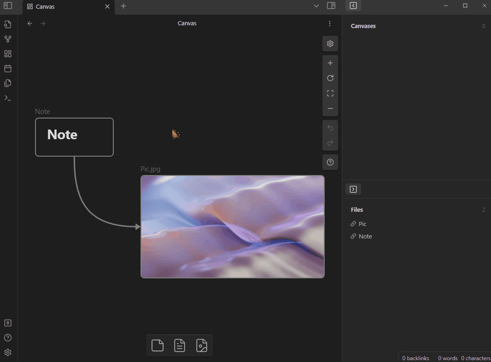

# Canvas View

The plugin register a command named "Show canvas view" for creating "Canvas View" pane, it used to show which canvases the current active file embedded in.

Switch the active file would change the shown canvases in pane accordingly, and click any canvas in pane would redirect the editor to it.

The plugin support all filetype that 
[Obsidian accepted](https://help.obsidian.md/Advanced+topics/Accepted+file+formats).

