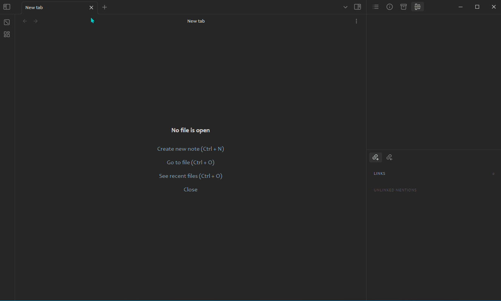

# Canvas Links

The plugin add views to show "outgoing links" and "backlinks" of canvas in [Obsidian](https://obsidian.md/). Enable the plugin and select command start with `Canvas Links:`.

- Register a view to show **Which canvases the active file embedded** like the backlinks of canvas for it
- Register a view to show **Which files the active canvas contains** like the outgoing links of canvas from it
- Support click item in view to redirect the current file to it and change the view content accordingly
- Support all filetype that [Obsidian accepted](https://help.obsidian.md/Advanced+topics/Accepted+file+formats)

